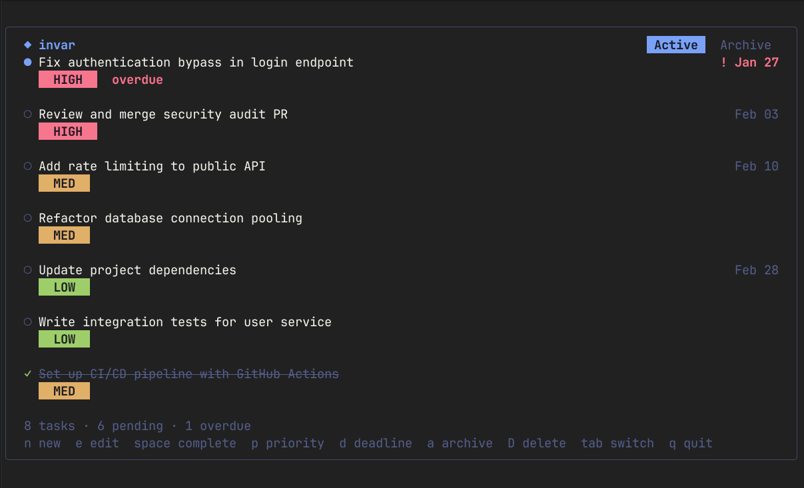

# Invar


## A terminal task manager built with Go and Charmbracelet libraries.



## Installation

```bash
go build ./cmd/invar
```

## Usage

```bash
invar              # Launch TUI
invar -n "task"    # Quick add a task
```

## Keybindings

| Key | Action |
|-----|--------|
| `j/k` or `↑/↓` | Navigate |
| `n` | New task |
| `e` | Edit task |
| `Space` | Complete/uncomplete |
| `a` | Archive/unarchive |
| `D` | Delete |
| `p` | Cycle priority (H→M→L) |
| `d` | Set deadline |
| `Tab` | Switch view (Tasks/Archive) |
| `q` | Quit |

## Data Storage

Tasks are stored in `~/.local/share/invar/tasks/` as JSON files.
